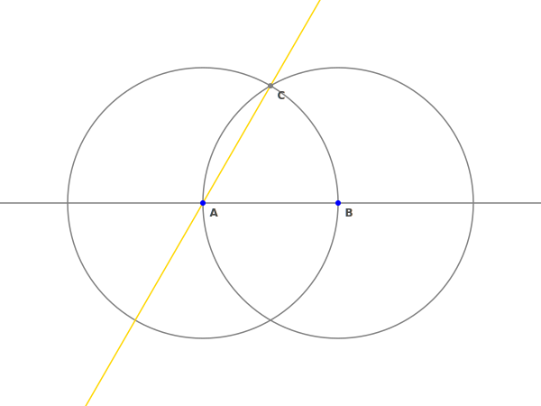

# dilcue

*A numerical solver for Euclidian geometry problems*

Given a set of points and initial constructions (line and circles), the solver will find a sequence of lines and circles to build in order to reach a set of targets.

This was written to explore whether the amazing game [Euclidea](https://www.euclidea.xyz) was solvable by machine, and as an assistant for solving the more complex problems.

Written in Lua (5.1 and following), output in plain text and SVG.

## Euclidea solutions

I implemented all Euclidea problems up to 5.4 so far.

[See the results here.](https://castux.github.io/dilcue/)

## Example use

```
local solver = require "solver"
local geom = require "geom"
local draw = require "draw"

local p1 = geom.Point(-100,0)
local p2 = geom.Point(100,0)
local p3 = geom.Point(0, 200 * math.sin(math.rad(60)))

local l1 = geom.Line(p1,p2)
local l2 = geom.Line(p1,p3)

local context =
{
	points = {p1, p2},
	objects = {l1},
	targets = {l2}
}

solver.solve(context, 3)
print(solver.pretty_print(context))
print "\n"
print(draw.draw(context))
```

Will produce:

```
* A: given (-100.00,0.00)
* B: given (100.00,0.00)
circle: ⊙AB
circle: ⊙BA
* C = ⊙AB x ⊙BA (0.00,173.21)
line: (AC)


<svg width="600" height="450" viewbox="-400.00 -300.00 800.00 600.00">
... output shortened for clarity ...
</svg>
```

And the SVG looks like:



## Algorithm

The solver uses a rather straightforward depth-first tree exploration. At each step, it considers all possible lines and circles that can be built using pairs of existing points, ignoring duplicates. It picks one, builds it, and computes all intersections with previous lines and circles, again avoiding to duplicate points. Then it recurses until it reaches the maximum allowed depth, after which it backtracks and tries other constructions at each level, until a solution is found.

## Optimizations

The only optimizations that I found significantly help with the resolution of problems are the following:

- At each step, build all possible constructions, but first try those that are targets for the problem. In many cases, the targets are built last, or building one helps building the rest of them, and therefore, if a target can be built, it should be done right away.
- At each step, compare the number of steps left to the number of targets that still need to be built. No point looking for a solution in 3 steps if there are 4 targets. This is particularly helpful for problems that ask to build a polygon: often, all the points are available, and the last few steps are just about drawing the lines. This and the previous optimization make it almost immediate, when possible, instead of pointlessly searching the whole remainder of the tree.

## Difference with Euclidea

In the Euclidea game, building points is always a free action, and points can be built:

- at intersections
- arbitrarily, on existing lines and circles
- arbitrarily, outside of existing lines and circles

This solver only considers the initial set of points, and intersections with new lines and circles. Some Euclidea problems (notably 2.7 and 2.8) make use of "arbitrary" points. Although the solver can easily build any such outside point via lines and circles, it would cost one or more additional steps, compared to the optimal solution in Euclidea. For this reason, it can be useful to add such arbitrary points to the initial set, to get the same number of steps as in Euclidea.

Another difference is that Euclidea distinguishes lines, half-lines and segments. This solver considers all lines infinite, and therefore sometimes seems to find a better solution than Euclidea (less steps), or solutions that require additional steps in Euclidea (prolonging an existing segment into an infinite line).

I find that segments and half-lines are not very much in the spirit of Euclidian geometry and decided not to implement them.

## Caveats

- The solver does not (re)build intersections between objects given in the initial context. Only intersections with new objects. Make sure that your initial set of points contains all intersections between initial lines and circles.
- All computations are done using double-precision floating point numbers, which accumulate errors over time. Two points are considered equal if their computed distance is less than a certain `epsilon`, hard coded to `1e-5`. Likewise for a point on a line or circle, etc.
- This is purely numerical, there is no attempt to prove correctness in any way or to deduce geometrical facts. There is no way to express "must work for any point such that X" or similar statements. This is why I use a lot of random looking numbers in the problem definitions, to avoid accidentally falling on a special case for which the solution is easier to find.

## Computational complexity

The number of objects buildable at each step is proportional to the square of the number of existing points (one line and two circles for each pair of points). The number of points added after a line or circle is built is proportional to the existing number of lines or points.

Consequently, the number of buildable objects and the number of points at each step grows extremely fast. Even for the minimal possible initial state (two distinct points), the number of leaves of the search tree grows as follows:

```
1	3
2	6
3	40
4	956
5	48316
6	~ 6 million
7	~ 1 billion
```

And this is a lower bound: most problems have more points and constructions in their initial state. In practice on my machine, problems of 5 steps or less take a few seconds, 6 steps can take a few minutes, and I never saw 7 or above go to completion.

## Restrictions

In order to help the solver with bigger problems, you can provide a series of restrictions, or hints:

```
local context =
{
    points = {p2,p3},
    objects = {C(p1,p2)},
    targets = {p1},
    restrictions = {"circle", "circle", nil, "line", "line"}
}
```

The array elements should match the steps. If the Nth hint is the string `"circle"` or `"line"`, the solver will only try that particular construction at the Nth step. `nil` will be ignored.

An even stronger hint can be given: if the Nth hint is an actual `Line` or `Circle` object, the solver will only allow that exact object to be built at step Nth, backtracking if it wasn't able to built it.

This is effectively cheating, but it allows, for instance, to split a problem of 10 steps (unsolvable) into two problems of 5 steps (actually doable).

When implementing the Euclidea problems, I add increasingly stronger hints until the solver can solve the problem in less than a minute. It's for the fun of seeing the solutions being drawn, after all (especially the problems that are trivial for a human, but would be too long to solve for the machine, like 4.5)

## License

This software is distributed under the MIT license. Enjoy!
